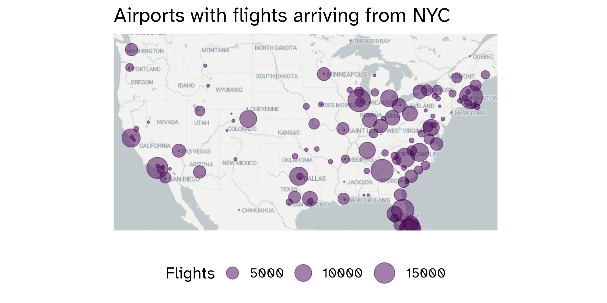

```{r setup, include=FALSE}
knitr::opts_chunk$set(echo = TRUE,
                      message = FALSE,
                      warning = FALSE)
library(tidyverse)
library(ggthemes)
library(nycflights23)
```

Our first lab quiz is scheduled for **Friday of Week 3**. The first half of class will cover new content, and the second half of class you will complete the in-person portion of the lab quiz.

# Guidelines

This is a *closed note*, *closed internet resources*, *closed other people* lab quiz. I want to see what's in your brain! You may use the help pages built-in to R (accessed by `?ggplot`), and the cheat sheets provided by me, but otherwise you may not use any resources.

On the resubmission, you may use my slides and your own notes from class, but you shouldn't use other internet resources or get help from anybody but me.

The lab quizzes are not written to be tricky or hard. If you've been completing the in-class activities and the homework, and putting the time and effort in to understand them, you should do well on the lab quizzes.

# Skills

## R Basics

-   Given a vector, list, or data frame, extract an element of interest.
    -   Know how to use each extractor (`x$__`, `x[__]`, `x[[__]]`) and what they return
    -   Construct logical vectors to use as an index to subset a vector or data frame
    -   Construct integer vectors to use as an index to subset a vector or data frame
-   Given a vector, list, or data frame, obtain a quick summary such as the length, dimension, or type of each element
    -   Functions to know: `length()`, `nrow()`, `ncol()`, `dim()`, `summary()`, `glimpse()`, `class()`, `typeof()`, `head()`, `tail()`.

## Data Visualization

-   Identify the appropriate layer to add to a static graphic in order to display specific information
    -   You should know the `geom` (and associated aesthetics) for the following charts: bar/column chart, histograms, boxplots, density plots, violin plots, scatterplots, time series line plots, map, chloropleth map
-   Given a graphical summary and data set, recreate the graphic
    -   base layers
    -   axis labels, titles, captions
    -   `scale_x` functions for aesthetics
    -   `facet_wrap()` and `facet_grid()`
-   Given a question of interest and data set, construct an appropriate graphic to address/answer the question
    -   You should know when the graphs mentioned above are appropriate
-   Given a graphic, describe the strengths and weaknesses of it from a design perspective
    -   Core principles:
    -   Accessibility considerations: color, alt text, direct labeling, etc.

## Data Wrangling

-   Know how the following verbs act on a data set: `filter`, `slice`, `select`
    -   Syntax for using
    -   Describe what the output would look like
-   Given a data set and goal, identify and utilize the appropriate verb to create the data set of interest
-   Use {dplyr} verbs AND the logical vector approach to subset a data frame 

# Grading

For the in-class portion, I will grade your .rmd's and be looking directly at your code. You'll earn points through the following:

-   1 point per question (successful or not successful; 0.5's possible)
-   1 point if I can knit your file (to .pdf, .html, or github md)
-   1 point for submitting via GitHub

If you have trouble knitting or submitting via GitHub, submit your .rmd via email. There will be a 5 minute grace period past the end of class to submit, but I will not accept submissions beyond that point.

## Resubmission

You may resubmit the lab quiz by **11am on Sunday (48 hours)**. Resubmissions will be submitted through Gradescope (just like you turn in homework). All questions and grading will remain the same. You do not have to resubmit if the in-class portion went well; there is no benefit to doing the resubmission if you earn 100% on the in-class portion. 

# Practice Quiz

## Rules

1.  Your solutions must be written up in the R Markdown (Rmd) file called lab-quiz-01.Rmd. This file must include your code and write up for each task. Your "submission" for the in-class portion will be whatever is in your repository at the end of the quiz period. Commit and push the Rmd and outputs of that file.

2.  This exam is closed notes, closed internet, closed other people. You may **only** refer to the built-in help pages in R and the printed cheat sheets provided by me.

3.  You have until 10:45am to complete this exam and turn it in via your personal Github repo. Do not wait until the last minute to knit / commit / push! 

    -   If you do have technical issues, you will be able to solve them for the resubmission, but if you do not turn in the in-class portion you will not receive any points
        -   Example: I run into a knitting issue and don't leave myself time to commit and push to github, so I'm not able to turn anything in for the in-class portion. I work hard over the weekend to make sure everything is correct for the resubmission. I earn 0/10 on the in-class and 10/10 on the resubmission, so my score for the lab quiz is 10/20.
        -   Example: I run into a knitting issue 2 minutes before the deadline, but make sure to commit my .rmd and push to github before trying to solve the issue. I fix the knitting issue over over the weekend, and also find an error in one of my problems I submitted. I earn 8/10 on the in-class (1 unsuccessful problem + no output file) and 10/10 on the resubmission, so my score for the lab quiz is 18/20.

4.  Even if the answer seems obvious from the R output, make sure to state it in your narrative as well. For example, if the question is asking what is 2 + 2, and you have the code in your document, you should additionally have a sentence that states "2 + 2 is 4."

5.  You may only use `tidyverse` and `nycflights13` (and its dependencies) for this quiz Your solutions may not use any other R packages.

## Data

The `nycflights23` package contains information about all flights that departed from NYC (e.g. EWR, JFK and LGA) in 2023. The main data is in the `flights` data frame, but there are additional data sets which may help understand what causes delays, specifically:

-   `weather`: hourly meteorological data for each airport
-   `planes`: construction information about each plane
-   `airports`: airport names and locations
-   `airlines`: translation between two letter carrier codes and names

For this lab quiz, we're going to work with a random sample of this data (called `flights_sampl`)

```{r}
library(tidyverse)
library(nycflights23)
q <- 0
```

## Questions

### Question `r (q<- q+1)`

Write out two different ways to access the `dep_delay` variable in the `flights` dataset that do *not* use {dplyr} verbs. Save each to an object called `dep_delay1` and `dep_delay2`.

### Question `r (q<- q+1)`

The code below creates a new dataset called `delayed_flights`, which consists of all flights that had a departure delay of more than 5 minutes. Show me a second way to create this dataset. (*Hint:* One option is to create a logical vector, and then index the `flights` data using that vector)

```{r}
delayed_flights <- flights %>%
  filter(dep_delay > 5)
```

### Question `r (q<- q+1)`

Is there a relationship between departure delay (among flights that departed at least 5 minutes late) and which NYC airport the flight departed from? Create an appropriate visualization to answer this question. (use the `delayed_flights` dataset)

### Question `r (q<- q+1)`

Recreate the plot included below using the `flights` data. Once you have created the visualization, in no more than one paragraph, describe what you think the point of this visualization might be.

```{r}
#| echo: false
flights %>%
  ggplot(aes(x = air_time, y = dep_delay, col = month)) + 
  geom_point(size = .5) + 
  facet_wrap(vars(month)) 
```

### Question `r (q<- q+1)`

Is this a chloropleth map? Explain how you can tell.



### Question `r (q<- q+1)`

In the map above, what is the `geom`(s) used? What about the aesthetics?
