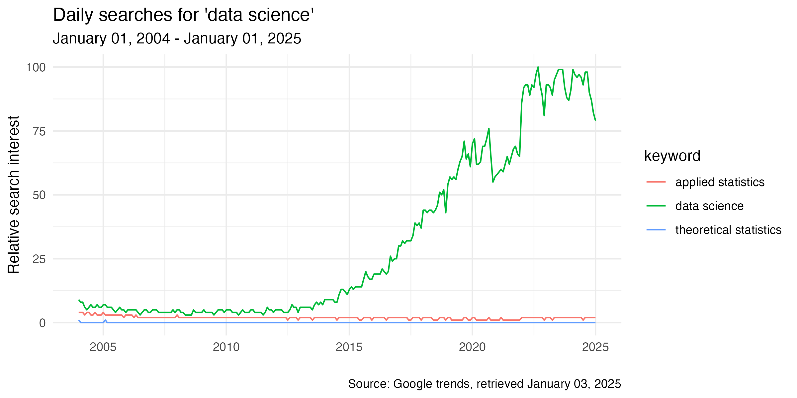
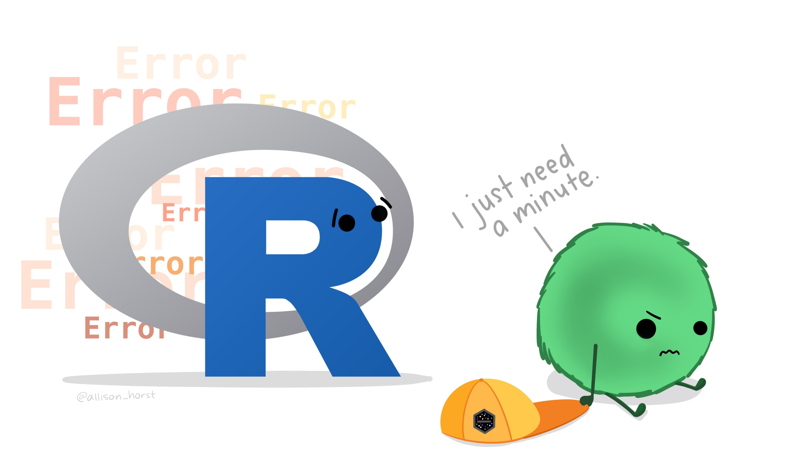
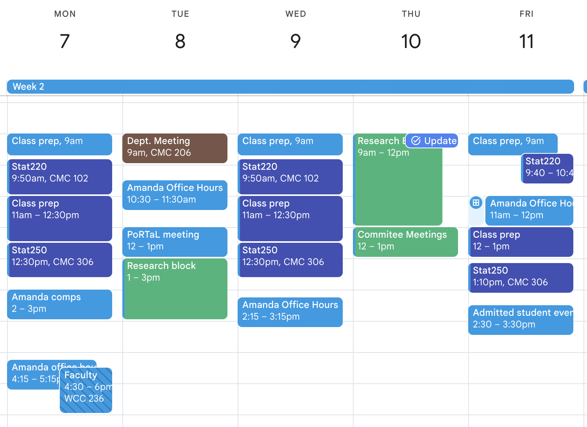

```{r}
#| echo: false
#| warning: false
#| message: false

library(gtrendsR)
library(countdown)
library(tidyverse)
library(lubridate)
```

# Intros

## About me

::::: columns
::: {.column width="50%"}
-   First year at Carleton!
-   Taught at Swarthmore for 5 years before moving here this fall
-   PhD in Statistics & Data Science from Carnegie Mellon University
-   Grew up in Minnesota, went to St Ben's as an undergrad
:::

::: {.column width="50%"}

:::
:::::

## What is "data science"?

. . .



```{r}
#| eval: false
#| include: false

ds_trend <- gtrends(c("data science", "theoretical statistics", "applied statistics"),  time = "all")[[1]]
# not letting me search for a single term

format_date <- stamp("August 1, 2021")
ds_trend |>
  mutate(
    hits = as.numeric(ifelse(hits == "<1", 0, hits))
  ) |>
  ggplot(aes(x = date, y = hits, col = keyword, grp = keyword)) +
  geom_line() +
  theme_minimal() +
  labs(
    title = "Daily searches for 'data science'",
    subtitle = str_c(format_date(min(ds_trend$date)), " - ",  format_date(max(ds_trend$date))),
    y = "Relative search interest",
    x = "",
    caption = str_c("Source: Google trends, retrieved ", format_date(Sys.time()))
  )

ggsave(, filename = "slides/01/gtrends-data-sci.png", width = 8, height = 4)
```

## What is this class about?

-   **Develop** research questions that can be answered with data
-   **Acquire** data from multiple sources
-   **Wrangle** common types of data
-   **Visualize** data to provide insight
-   **Communicate** your findings
-   **Document** your code and **collaborate** on coding projects

##  {background-image="../img/data_scientist_infographic.png" background-position="right" background-size="50%"}

:::: columns
::: {.column width="50%"}
### What skills do you need?

-   programming with data

-   statistical modeling

-   domain knowledge

-   communication
:::
::::

## What is this class all about?

{.r-stretch}

::: aside
Image by Adam Loy <br> adapted from work of Joe Blitzstein, Hanspeter Pfister,<br> and Hadley Wickham
:::

## Why R?

> *And the second reason, which is both a huge strength of R and a bit of a weakness, is that R is **not just a programming language**. It was designed from day 1 to be an **environment that can do data analysis**. So, compared to the other options like Python, you can get up and running in R doing data science, learning much, much less about programming to get started. And that generally makes it like **easier to get up and running if you don’t have formal training in computer science or software engineering**.*

> -Hadley Wickham, [Advice to Young (and Old) Programmers: A Conversation with Hadley Wickham](https://www.r-bloggers.com/advice-to-young-and-old-programmers-a-conversation-with-hadley-wickham/)

##  {background-image="../img/wordcloud-nervous.png" background-size="contain"}

## {.smaller}

::::: columns
::: {.column width="60%" .center}
{fig-align="left"}
:::

::: {.column width="40%"}
It’s easy when you start out programming to get really frustrated and think, “Oh it’s me, I’m really stupid,” or, “I’m not made out to program.” But, that is absolutely not the case. **Everyone gets frustrated**. I still get frustrated occasionally when writing R code. **It’s just a natural part of programming**. So, it happens to everyone and gets less and less over time. *Don’t blame yourself. Just take a break, do something fun, and then come back and try again later.*
:::
:::::

::: aside
Hadley Wickham, [Advice to Young (and Old) Programmers: A Conversation with Hadley Wickham](https://www.r-bloggers.com/advice-to-young-and-old-programmers-a-conversation-with-hadley-wickham/);<br> Artwork by Allison Horst
:::

## Maize Server

::: {.large style="text-align: center;"}
<https://maize.mathcs.carleton.edu>
:::

-   Browser based RStudio instance(s) provided by Carleton

-   Requires internet connection to access

-   Provides consistency in hardware and software environments

-   Local R installations are also fine! But it may be harder for me to provide support

# A first example: UN Votes

## On your own:

::: {.task .nonincremental}
1.  Log into the maize server: maize.mathcs.carleton.edu
2.  Follow the directions at <https://stat220-w25.github.io/computing/rstudio-stat220> to create an "activities" folder
3.  Open `01-example-unvotes` from <https://stat220-s25.github.io>, copy and paste the .Rmd into a new file in RStudio
4.  Skim the file *without* running any code:
    -   Where is the *code*?
    -   Where is the *narrative*?
5.  Run each code chunk in order. What does this analysis do?
:::

```{r echo=FALSE}
countdown(minutes = 10, seconds = 0)
```

## What steps went into this analysis?

-   Recording the original data
-   Accessing data via an R package
-   Combining multiple datasets into one
-   Data cleaning: filtering, creating new columns, grouping, summarizing
-   Making a graph
-   Fitting a smooth line model

## Your turn:

::: task
With your neighbor(s):

Choose two countries to compare to the U.S. voting record in the U.N. over the years.

What did you learn?
:::

```{r echo=FALSE}
countdown(minutes = 4, seconds = 0)
```

# Syllabus highlights

Read the full syllabus by next class

## Course website

::: {.large style="text-align: center;"}
<https://stat220-s25.github.io>
:::

::: {.hand style="text-align: center;"}
aka "the one link to rule them all"
:::

-   access slides
-   see schedule

::: {.large style="text-align: center;"}
<https://github.com/stat220-s25>
:::

-   access repositories for homework and projects

## Office hours (*tentative*)

| Day       | Time        | Type    | Location |
|:----------|:------------|:--------|:---------|
| Monday    | 4:15-5:15   | Drop-in | CMC 307  |
| Tuesday   | 10:30-11:30 | Drop-in | CMC 307  |
| Wednesday | 2:15-3:15   | Drop-in | CMC 307  |
| Friday    | 11-12       | Drop-in | CMC 307  |

## Where is Amanda this term? {.center}


{width=80%}


## What will you do in this course?

::::: columns
::: {.column width="50%"}
**Graded work:**

-   Homework
-   Lab Quizzes
-   Portfolio Projects
-   Final Project
-   In-class exercises
:::

::: {.column width="50%"}
**Ungraded work:**

-   Daily prep for class: read/watch/review/try
-   Engagement in small and large group discussions
:::
:::::

## What will a typical day/week look like?

:::::: columns
::: {.column width="30%"}
**Before class:**

-   Watch a video or read a chapter
-   Come with questions
-   Be prepared to try what was covered
:::

::: {.column width="30%"}
**In class:**

-   Mini lecture
    -   Sometimes review
    -   Sometimes new
-   Hands-on coding in R
:::

::: {.column width="30%"}
**After class:**

-   Finish in-class exercises
-   Work on homework and portfolio projects
:::
::::::

## Grading system {.smaller}

Homework and lab quiz problems will be graded as *successful*, *half credit*,  or *not successful*.  Projects will be graded as *excellent*, *successful*, or *not successful*. You will have the opportunity to resubmit the lab quizzes outside of class.

To earn a course grade, you must meet **all** of the requirements in a given row:

|   | Homework Problems | In class activities | Lab Quiz Problems | Portfolio Projects (4 total) | Final Project |
|---------------|---------------|---------------|---------------|---------------|---------------|
| A | 85% | 90% | 90% | 2 Excellent + 2 Successful | Excellent |
| B | 75% | 80% | 80% | 4 Successful | Successful |
| C | 65% | 70% | 70% | 3 Successful | Successful |
| D | 55% | 50% | 50% | 2 Successful | Successful |

"+" and "-" grades are determined by partially meeting the requirements in a given row.

## Benefits

-   You decide what grade you're aiming for, and what you have to do to earn it
-   Clear guidelines for "successful" and "excellent" grades on projects
-   Opportunity to revise and resubmit

## Possible drawbacks

-   No traditional partial credit! 
-   Half-credit is for *completed* and *mostly correct*
-   Revisions take time
-   Categories don't "average out"

## Tokens

You can use a token to:

-   Revise a portfolio project that did not earn a "successful" or "excellent"
-   72-hour extension on a homework assignment or portfolio project submission (the request must be submitted before the deadline)
-   72-hour extension on lab quiz resubmissions (the request must be submitted before the deadline)
-   By passing the syllabus quiz, you'll activate your 5 tokens for the term. I will track token balances in the moodle gradebook (updated weekly, typically Thursdays)

## Collaboration policy {.smaller}

|   | Collaboration Allowed |
|------------------------------------|------------------------------------|
| Homework Problems | You are allowed and encouraged to collaborate on homework. You may also use outside resources, but your submitted work must be your own and reflect your own understanding . |
| Lab Quiz Problems | **No collaboration is allowed at all** . You may use your own notes for resubmissions, but should not use outside resources. |
| Portfolio Projects | You are expected to collaborate with your group, but cannot rely on external sources other than to help motivate the questions or provide other background information. Getting answers on significant parts of solutions from outside resources is not allowed. |
| Final Project | You are expected to collaborate with your group, but cannot rely on external sources other than to help motivate the questions or provide other background information. Any outside resources should be properly cited. |

: {tbl-colwidths="\[15,85\]"}

## Use of generative artificial intelligence (AI) {.smaller}

-   Treat generative AI, such as ChatGPT or Gemini, the same as other online resources.

-   Guiding principles:

    -   \(1\) *Cognitive dimension:* Working with AI should not reduce your ability to think clearly. AI should facilitate—rather than hinder—learning.

    -   \(2\) *Ethical dimension***:** Students using AI should be transparent about their use and make sure it aligns with academic integrity.

-   **❌ AI tools for writing code:** You may not use generative AI to take a "first pass" at a coding task. Do not type coursework prompts directly into AI tools.

-   **✅ AI tools for debugging code:** You may make use of the technology to get help with error messages or trying to fix issues. Rule of thumb: never type code into or out of an AI interface

-   **❌ AI tools for narrative:** Unless instructed otherwise, you may not use generative AI to write narrative on assignments. In general, you may use generative AI as a resource as you complete assignments but not to answer the exercises for you.

::: aside
Adapted from Mine Çetinkaya-Rundel
:::


## GitHub {.smaller}

::: {.large style="text-align: center;"}
<https://github.com/stat220-w25>
:::

-   GitHub organization for the course

-   All of your work and your membership (enrollment) in the organization is private

-   Each assignment is a private repo on GitHub, I distribute the assignments on GitHub.

-   You will work on your assignment, then "knit 🧶 commit ✅ push ⤴️"

-   You'll then be able to submit your PDF via gradescope

. . .

::: task
Fill out the *Welcome Survey* for collection of your account names, later this week you will be invited to the course organization.
:::

## Username advice {.smaller}

::: hand
in case you don't yet have a GitHub account...
:::

Some brief advice about selecting your account names (particularly for GitHub),

-   Incorporate your actual name! People like to know who they're dealing with and makes your username easier for people to guess or remember

-   Reuse your username from other contexts, e.g., Twitter or Slack

-   Pick a username you will be comfortable revealing to your future boss

-   Shorter is better than longer, but be as unique as possible

-   Make it timeless. Avoid highlighting your current university, employer, or place of residence

# Wrap up

## Your tasks before next class

1.  Create a GitHub account if you don't have one

2.  Complete the welcome survey if you haven't already

3.  Join the slack workspace and post an `#intro` message

4.  Read the syllabus and pass syllabus quiz

5.  Make sure you can log in to the maize server or update your local R/RStudio versions

6.  Complete the readings for next class
