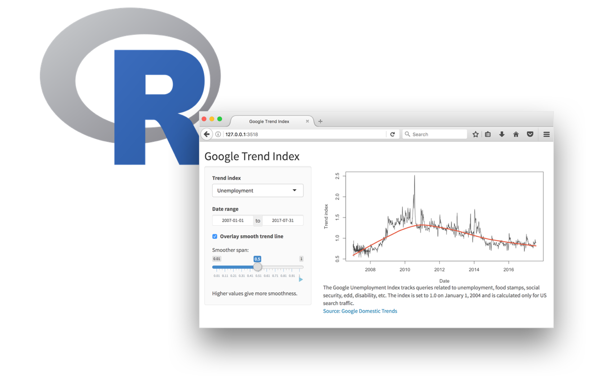
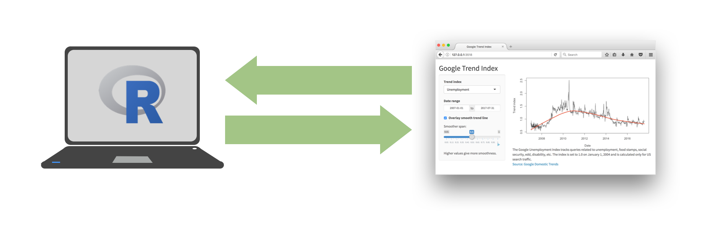
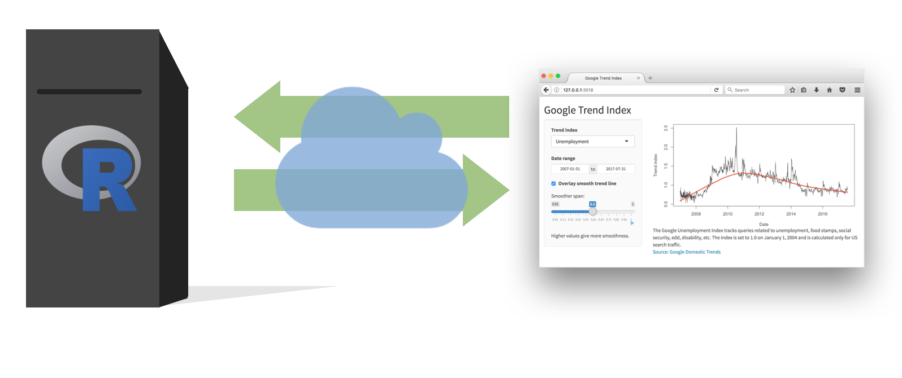
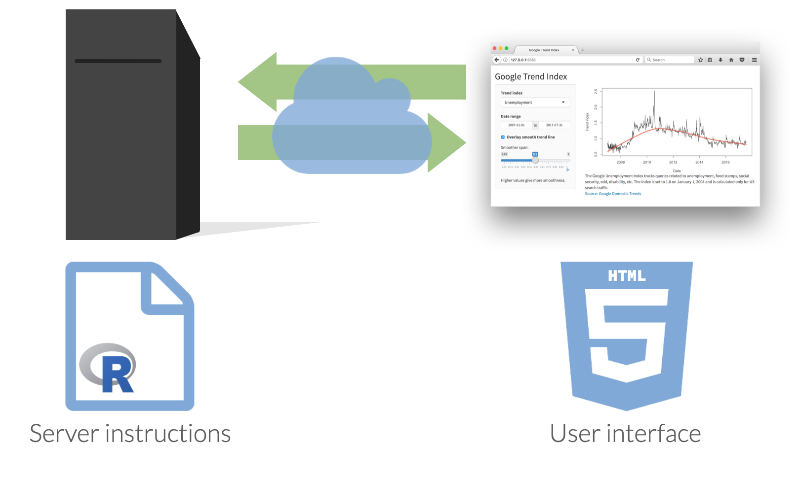

```{r setup, include=FALSE}
knitr::opts_chunk$set(echo = TRUE, message = FALSE, warning = FALSE)

library(countdown)
library(tidyverse)
library(lubridate)
library(palmerpenguins)
library(patchwork)
library(ggthemes)
library(nycflights23)
library(here)
library(httr2)
library(rvest)
slides_theme = theme_minimal(
  base_family = "Atkinson Hyperlegible",
  base_size = 16)

theme_set(slides_theme)
```


## Demo

```{r}
#| echo: false
#| fig-align: center
#| out-width: "100%"
knitr::include_app("https://gallery.shinyapps.io/goog-trend-index/", height = "650px")
```


# Shiny: High level view

## 
Every Shiny app has a webpage that the user visits, <br> and behind this webpage there is a computer that serves this webpage by running R.

```{r echo = FALSE, out.width = "80%"}

```

##  {.center}

When running your app locally, the computer serving your app is your computer.

```{r echo = FALSE, out.width = "100%"}

```

##  {.center}

When your app is deployed, the computer serving your app is a web server.

```{r echo = FALSE, out.width = "100%"}

```

##  {.center}

```{r echo = FALSE, out.width = "100%"}

```

## Shiny vs. plotly

- **Shiny** graphs need to be "connected" to RStudio or an Rstudio server

    + Why? Data sets are rewrangled and a new graphic is drawn
    
- **plotly** isn't changing the underlying data set/stats being displayed, can be displayed on webpage without an RStudio session

## Getting started

::: {.nonincremental}

Option 1: Embed a shiny plot/table in HTML docs

- Need add `runtime: shiny` to your YAML header

:::
. . . 

::: {.nonincremental}
Option 2: Can create an `app.R` file with a `ui()` and `server()` function 

- For template <br>`New Files > R Markdown > Shiny - New Files > Shiny Web App`
:::


## What's in an app?

::: columns
::: {.column width="50%"}
```{r eval = FALSE}
library(shiny)
ui <- fluidPage(
  inputs,
  outputs
)


server <- function(
    <reactive functions and code to render output>) {
  ...
}
`

shinyApp(
  ui = ui, 
  server = server
)
```
:::

::: {.column width="50%"}
-   **User interface** controls the layout and appearance of app

-   **Server function** contains instructions needed to build app
:::
:::

## Defining inputs 


```{r eval=FALSE}
ui <- fluidPage(
  inputPanel(
        selectInput('xcol', 
                    label = 'X Variable', 
                    choices = colnames(manager_survey), 
                    selected = names(manager_survey)[16]),
      )
)
```

- `inputPanel()` creates an `input` list consisting of the user's selections
- `selectInput()` makes a dropdown select menu
- `xcol` is the name of the input variable. Make sure input names are unique!

## Render output 

```{r eval=FALSE}
server <- function(input, output) {
    output$scatterPlot <- renderPlot({
    manager_survey |>
      filter(industry %in% input$industry) |>
      ggplot( aes_string(x = input$xcol, y = "annual_salary")) +
      geom_jitter(size = 2, alpha = 0.6, aes(color = industry)) +
      theme(legend.position = "top")
  })
}
```

- Access input values with `input$input_name`
- Save objects to display to `output$object_name`
- Build objects to display with `renderSomething()`

## Add output to the UI function

```{r eval=FALSE}
ui <- fluidPage(
      inputPanel(
        selectInput('xcol', 
                    label = 'X Variable', 
                    choices = colnames(manager_survey), 
                    selected = names(manager_survey)[16]),
      ),
    
   plotOutput(outputId = "scatterPlot")
)
```

- `typeofOutput("object_name")` will try to pull off the `object_name` element of the `output` list
- Make sure output names are unique

## Add a title 

```{r eval=FALSE}
ui <- fluidPage(
  
    titlePanel(title = "Exploring the Ask a Manager data"),

      inputPanel(
        selectInput('xcol', 
                    label = 'X Variable', 
                    choices = colnames(manager_survey), 
                    selected = names(manager_survey)[16]),
      ),
    
   plotOutput(outputId = "scatterPlot")
)
```

- `typeofOutput("object_name")` will try to pull off the `object_name` element of the `output` list
- Make sure output names are unique


## Data: Ask a manager

Source: Ask a Manager Survey via [TidyTuesday](https://github.com/rfordatascience/tidytuesday/tree/master/data/2021/2021-05-18)

> This data does not reflect the general population; it reflects Ask a Manager readers who self-selected to respond, which is a very different group (as you can see just from the demographic breakdown below, which is very white and very female).

Some findings [here](https://www.askamanager.org/2021/05/some-findings-from-24000-peoples-salaries.html).

## Data: `manager-survey.csv`

```{r}
#| message: false
manager <- read_csv("https://stat220-w26.github.io/data/manager-survey.csv")
manager
```


## Your turn 

::: {.task .nonincremental}
1. Run the app! What does it show us?
2. Read the code: find the inputs and the outputs
3. Adapt the app to allow the user to specify what variable maps to the point color in the scatterplot
4. Adapt the app to allow the user to filter the data by `annual_salary`. Allow values between the minimum and maximum `annual_salary` selected. 
5. Adapt the app to allow the user to select whether the plot should have a white background
6. Add a histogram that allows the user to select what quantitative variable should be displayed. Add any other interactive elements (e.g., binwidth adjustments) that you want to.
:::


