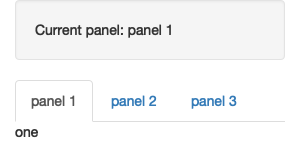
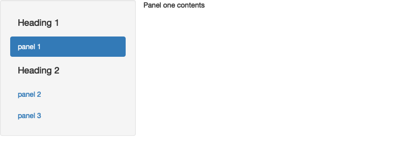
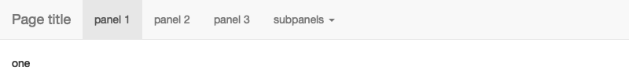
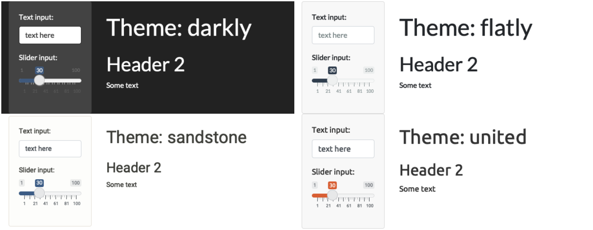
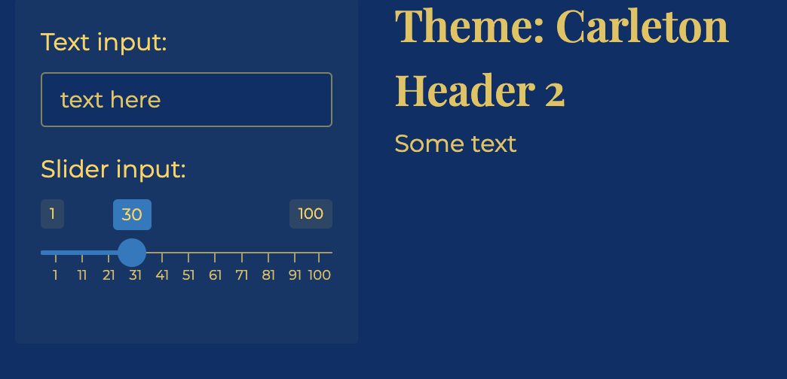
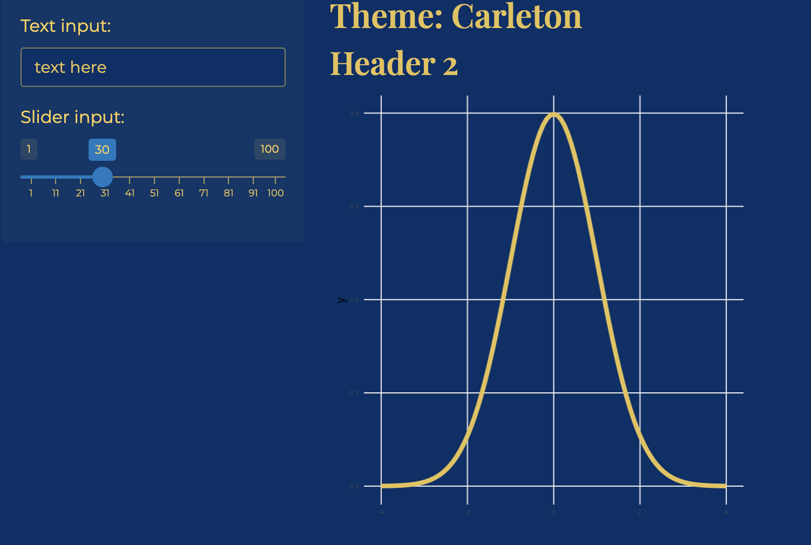
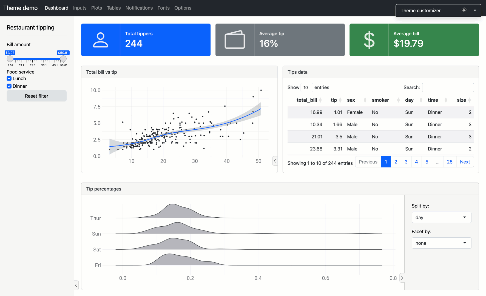

```{r setup, include=FALSE}
knitr::opts_chunk$set(echo = TRUE, message = FALSE, warning = FALSE)

library(countdown)
library(tidyverse)
library(lubridate)
library(palmerpenguins)
library(patchwork)
library(ggthemes)
library(nycflights23)
library(here)
library(httr2)
library(rvest)

slides_theme = theme_minimal(
  base_family = "Atkinson Hyperlegible",
  base_size = 16)

theme_set(slides_theme)
```

## GitHub collaboration activity

When you and your teammates work on the lines of code within a document and both try to push your changes, you will run into issues.

Merge conflicts happen when you merge branches that have competing changes, and Git needs your help to decide which changes to incorporate in the final merge.

Our first task today is to walk you through a merge conflict!

## Git review

-   Pushing to a repo replaces the code on GitHub with the code you have on your computer.
-   If a collaborator has made a change to your repo and pushed it to your collaborative GitHub repository, GitHub will stop you from pushing your changes to the repo because this could overwrite your collaborator's work!
-   So you need to explicitly "merge" your collaborator's work before you can **push**.
-   If your and your collaborator's changes are in different files or in different parts of the same file, git merges the work for you automatically when you **pull**.
-   If you both changed the same part of a file, git will produce a **merge conflict** because it doesn't know how which change you want to keep and which change you want to overwrite.

## Merge conflicts {.smaller}

::::: {.columns}

::: {.column width="50%"}

```text
<<<<<<< HEAD 

See also: [dplyr documentation](https://dplyr.tidyverse.org/)   

======= 

See also [ggplot2 documentation](https://ggplot2.tidyverse.org/)  

>>>>>>> some1alpha2numeric3string4
```

:::

::: {.column width="50%" .nonincremental}

- The `===` separate *your* changes (top) from *their* changes (bottom).
- Note that on top you see the word `HEAD`, which indicates that these are your changes.
- And at the bottom you see `some1alpha2numeric3string4`. This is the **hash** (a unique identifier) of the commit your collaborator made with the conflicting change.
- Your job is to *reconcile* the changes: edit the file so that it incorporates the best of both versions and delete the `<<<`, `===`, and `>>>` lines.
- Then you can stage and commit the result.

:::

:::::

## Setup

::: {.task .nonincremental}
- Clone the `day25-yourgroup` repo and open `app.R`
- Assign the numbers 1, 2, and 3 to each team member. If your team has fewer than 3 people, some will need to have multiple numbers
- If your partner(s) aren't here and you are currently a group of 1, join up with a group of 2 (Amanda will add you to their repo)
- Then, follow the instructions in the activity file to cause and then resolve merge conflicts
:::

## Shiny: warm-up {.smaller}

::: {.task .nonincremental}
Open the following shinyapps and explore a little bit. 

+ [Data Wrangling](https://psu-eberly.shinyapps.io/data_wrangling/)
+ [Biodiversity in NPS](https://abenedetti.shinyapps.io/bioNPS/)
+ [Hex Memory Game](https://dreamrs.shinyapps.io/memory-hex/)
+ [Lake Profile Dashboard](https://gallery.shinyapps.io/lake-profile-dashboard/)
+ [Classification Trees](https://asluby.shinyapps.io/GSS_classification/)

With the folks around you, discuss: 

1. Did any apps stand out as enjoyable or useful? 
2. What features or design choices make an app stand out? 
3. Are there any small tweaks you could make to make them more usable?
:::

```{r}
#| echo: false

countdown::countdown(6)
```

## Your turn

::: {.task .nonincremental}
Choose one person to do the following in your repo: 

- Move the initial data preparation code to an R **script** called `data-prep.R` in the home folder
- Write the cleaned dataset to a CSV or .Rds file in a `data/` folder within the `app` folder
    + `write_rds(manager_survey, "/data/manager-survey.rds")`
- In the `app.R` file, load the data with `read_csv`
    + `manager_survey <- read_rds("data/manager-survey.rds")`
:::

```{r}
#| echo: false
countdown::countdown(5)
```

# Layouts {.maize}

## Page with sidebar

:::: {.columns}

::: {.column width="40%"}
```{r}
#| eval: false

fluidPage(
  titlePanel(
    # app title/description
  ),
  sidebarLayout(
    sidebarPanel(
      # inputs
    ),
    mainPanel(
      # outputs
    )
  )
)
```
:::


::: {.column width="60%"}

:::
::::

## Multi-row

:::: {.columns}

::: {.column width="40%"}
```{r}
#| eval: false

fluidPage(
  fluidRow(
    column(4, 
      ...
    ),
    column(8, 
      ...
    )
  ),
  fluidRow(
    column(6, 
      ...
    ),
    column(6, 
      ...
    )
  )
)
```
:::


::: {.column width="60%"}

:::
::::

## Multi-page: Tabsets

:::: {.columns}

::: {.column width="60%"}
```{r}
#| eval: false

ui <- fluidPage(
  sidebarLayout(
    sidebarPanel(
      textOutput("panel")
    ),
    mainPanel(
      tabsetPanel(
        id = "tabset",
        tabPanel("panel 1", "one"),
        tabPanel("panel 2", "two"),
        tabPanel("panel 3", "three")
      )
    )
  )
)
server <- function(input, output, session) {
  output$panel <- renderText({
    paste("Current panel: ", input$tabset)
  })
}
```
:::


::: {.column width="40%"}

:::
::::


## Multi-page: nav list

:::: {.columns}

::: {.column width="50%"}
```{r}
#| eval: false

ui <- fluidPage(
  navlistPanel(
    id = "tabset",
    "Heading 1",
    tabPanel("panel 1", "Panel one contents"),
    "Heading 2",
    tabPanel("panel 2", "Panel two contents"),
    tabPanel("panel 3", "Panel three contents")
  )
)
```
:::


::: {.column width="50%"}

:::
::::


## Multi-page: nav bar

:::: {.columns}

::: {.column width="50%"}
```{r}
#| eval: false

ui <- navbarPage(
  "Page title",   
  tabPanel("panel 1", "one"),
  tabPanel("panel 2", "two"),
  tabPanel("panel 3", "three"),
  navbarMenu("subpanels", 
    tabPanel("panel 4a", "four-a"),
    tabPanel("panel 4b", "four-b"),
    tabPanel("panel 4c", "four-c")
  )
)
```
:::


::: {.column width="50%"}

:::
::::

## Your turn

::: {.task .nonincremental}
(1 per group) Reorganize the app so that the two graphs show up on different panels, tabsets, or pages in a navlist. Commit and push the changes so everybody has the new version.
:::

```{r}
#| echo: false

countdown::countdown(5)
```

# Theming {.maize}

## Theming: built-in themes

```{r}
#| eval: false


fluidPage(
  theme = bslib::bs_theme(...)
)
```



## Theming: customize {.nostretch}

```{r}
#| eval: false

fluidPage(
  theme = bslib::bs_theme(
    bg = "#003069", 
    fg = "#ffd24f", 
    base_font = "Montserrat",
    heading_font = "Playfair Display SemiBold"
)
```

{width="50%" fig-align="center"}


## Plot theming {.nostretch}

```{r}
#| eval: false
#| code-line-number: 2

server <- function(input, output, session) {
  thematic::thematic_shiny()
  
  output$distPlot <- renderPlot({
    ggplot(...)
  })
}
```


{width="50%" fig-align="center"}

## {.nostretch}

Add `theme = bslib::bs_theme()` to your `ui()` function, and `bslib::bs_themer()` to your server function to try out different options interactively



## Your turn

::: {.task .nonincremental}
One person per group should: 

- Add a custom theme to the AskAManager app
- Update the ggplot themes to match

Run the app, commit, and push so everybody has the updated version.
:::

```{r}
#| echo: false
countdown::countdown(4)
```

## Deploying an app {.smaller}

::: {.nonincremental}
- Shiny apps need to be "connected" to RStudio or a remote RStudio server

- You can deploy shiny apps online
    + using Posit's cloud server (free/fee) - https://www.shinyapps.io/
        - ["Getting started"](https://docs.posit.co/shinyapps.io/guide/getting_started/) guide will walk you through connecting RStudio to your shinyapps.io account
        - note: there is also now an option to deploy via Connect Cloud from your github. Feel free to try it!
    + creating a shiny server

- Your app and files should be in their own **folder** and the entire folder is what you "deploy". You do *not* want multiple `app.R` or `.Rmd` files in that folder! 
:::
