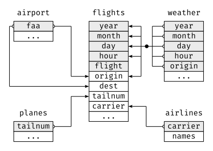
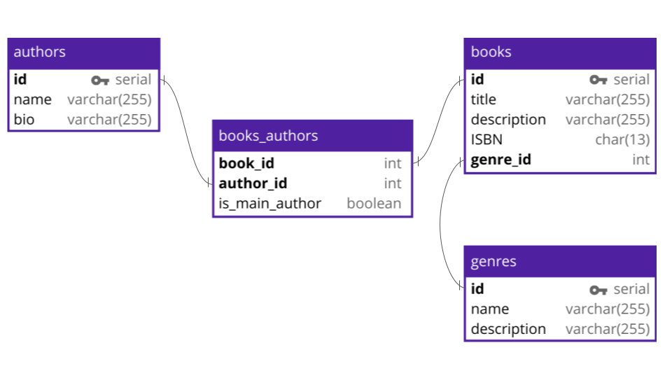

```{r setup, include=FALSE}
knitr::opts_chunk$set(echo = TRUE, message = FALSE, warning = FALSE)

library(countdown)
library(tidyverse)
library(lubridate)
library(palmerpenguins)
library(patchwork)
library(ggthemes)
library(nycflights23)
library(here)
library(httr2)
library(rvest)

slides_theme = theme_minimal(
  base_family = "Atkinson Hyperlegible",
  base_size = 16)

theme_set(slides_theme)
```


## Warm Up: on your own

::: {.task .nonincremental}
Review your responses to SQL exercises. Which do you feel confident about, and which would you like to discuss?
:::

## Warm Up: in groups

::: {.task .nonincremental}
discuss
:::

## Relational databases

Most databases contain multiple *tables* that are linked together via *keys* 


::::: columns
::: {.column width="50%"}
```{r}
nycflights23::flights %>%
  select(origin, dest, arr_delay, sched_arr_time)
```
:::

::: {.column width="50%"}
```{r}
nycflights23::airports %>%
  select(faa, name)
```
:::

:::::

## Relational databases

Most databases contain multiple *tables* that are linked together via *keys* 

::::: columns
::: {.column width="50%"}
```{r}
#| echo: false
survivoR::castaways %>%
  select(season, castaway_id, castaway, city) 
```
:::

::: {.column width="50%"}
```{r}
#| echo: false
survivoR::confessionals %>%
  select(season, episode, castaway_id, count = confessional_count)  
```
:::

:::::

## These relationships are often summarized with a *schema*

- All *tables* are listed
- Any variables that are *shared* across tables are listed
- All *relationships* between variables are connected with a line
- Other variables may or may not be included

## Schema: nycflights23 tables

{.r-stretch}

## Schema: imaginary bookstore

{.r-stretch}

## Connect to {mdsr} IMDB

```{r}
library(DBI)
con <- mdsr::dbConnect_scidb(dbname = "imdb")
```

## List tables in IMDB 

```{r}
table_names <- dbListTables(con)
table_names
```

## List columns in a given table

```{r}
dbListFields(con, "title")
dbListFields(con, table_names[1])
```

## Your turn

::: {.task .nonincremental}
List the fields in the `person_info`, `complete_cast`, and `comp_cast_type`. 
:::

```{r}
#| echo: false

countdown(2)
```

## Print first few rows of a table

```{r}
dbGetQuery(con, "SELECT * FROM title LIMIT 0,10")
```

# Interlude: SQL in RMarkdown

## Your turn

::: {.task .nonincremental}
List the first few rows in the `person_info`, `complete_cast`, and `comp_cast_type` tables. What did you learn?
:::

```{r}
#| echo: false

countdown(2)
```

## Practice with joins

```{sql connection=con}
SELECT * 
FROM title
LEFT JOIN kind_type ON title.kind_id=kind_type.id
LIMIT 0,10
```

## Practice with joins

```{sql connection=con}
SELECT * 
FROM title
LEFT JOIN kind_type ON title.kind_id=kind_type.id
WHERE kind='tv series'
LIMIT 0,10
```

## Your turn

::: {.task .nonincremental}
Join the `person_info`, `complete_cast`, and `comp_cast_type` tables
:::

```{r}
#| echo: false

countdown(3)
```

## Sketch out a schema

::: {.task .nonincremental}
Sketch out a schema for the following tables: 

- `title`
- `person_info`
- `movie_info`
- `complete_cast`
- `company_name`
- `role_type`
- `movie_link`

https://databasediagram.com/app
:::

```{r}
dbDisconnect(con)
```
